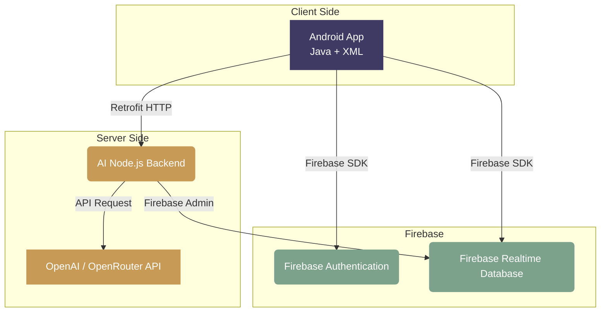

<div align="center">
  
  <h1>📚 Smart Library Management System</h1>
  <p><strong>A Premium, AI-Powered Digital Library Experience for Modern Institutions</strong></p>
  
  [](https://developer.android.com/)
  [](https://www.java.com/)
  [](https://firebase.google.com/)
  [](https://nodejs.org/)
  [](https://openai.com/)
</div>

<br/>

Welcome to the **Smart Library Management System** — a seamless, editorial-style interface designed with the "Ivory Library" theme. It provides an elegant experience for discovering, borrowing, and tracking books, integrated directly with a **Real-Time AI Assistant** for intelligent recommendations.

---

## 📸 App Screenshots

*(Note: Replace these placeholder image paths with actual screenshots of your app)*

<div align="center">
  
  &nbsp;&nbsp;
  
  &nbsp;&nbsp;
  
  &nbsp;&nbsp;
  
</div>

---

## ✨ Key Features

- 🎨 **Editorial UI/UX ("Ivory Library")**: Designed with a premium bookstore aesthetic, utilizing Warm Ivory backgrounds, Deep Indigo accents, and beautiful typography.
- 🤖 **Real-Time AI Assistant**: A Node.js backend integrated with OpenAI (or OpenRouter) provides context-aware book recommendations and library assistance directly within the mobile app.
- 🔐 **Firebase Integration**: Secure user authentication, Realtime Database for accurate book inventory, and cloud syncing.
- 📷 **QR Code Scanner**: Scan QR codes for rapid book checkouts and physical library navigation.
- 📚 **Smart Book Tracking**: Manage borrowed books, view availability in real-time, and track pending requests.

---

## 🏗 Architecture Diagram

Our architecture separates concerns by isolating AI credentials securely on the backend while allowing the Android client to remain fast and fluid.



---

## 🛠 Technology Stack

### Mobile Frontend
- **Language**: Java
- **UI Toolkit**: XML, Material Components for Android
- **Networking**: Retrofit 2, Glide (Image Loading)

### Cloud & Database
- **Backend-as-a-Service**: Firebase Realtime Database
- **Authentication**: Firebase Auth (Email/Password & Google Sign-In)

### AI Microservice
- **Runtime**: Node.js, Express.js
- **Intelligence**: OpenAI API SDK (Compatible with OpenRouter)

---

## 🚀 Getting Started

### 1. Android Application Setup
1. Clone the repository and open the project in **Android Studio**.
2. Go to [Firebase Console](https://console.firebase.google.com/), create a project, and register this Android app (`com.example.smartlibrary`).
3. Download the `google-services.json` file and place it in the `app/` directory.
4. Enable **Authentication** (Email & Google) and **Realtime Database** in Firebase.
5. Click **Run** in Android Studio to build the app onto your device or emulator.

### 2. AI Backend Setup
The AI feature requires the local Node.js server to run so that your secret API keys are never exposed in the Android APK.

```bash
# Navigate to the backend folder
cd backend

# Install dependencies
npm install
```

Create a `.env` file inside the `backend` folder and add your AI API Key:
```env
# Use either OpenAI or OpenRouter
OPENAI_BASE_URL=https://openrouter.ai/api/v1  # Remove this line if using standard OpenAI
OPENAI_API_KEY=sk-your-api-key-here
AI_MODEL=openai/gpt-3.5-turbo
```

Start the server:
```bash
npm start
```

> **⚠️ Important Device Note**: If you are testing the app on a physical Android device, you must update the `BASE_URL` in `AiRepository.java` from `http://10.0.2.2:3000/` to your computer's local Wi-Fi IP address (e.g., `http://192.168.1.5:3000/`).

---

## 🎨 Theme Guidelines ("Ivory Library")

The application strictly follows a custom design system to maintain a professional, academic, and calm environment.

- **Primary Background**: Warm Ivory `#F7F3EA`
- **Card Background**: Soft White / Ivory `#FFFDF8`
- **Primary Text**: Deep Ink `#24221F`
- **Secondary Text**: Warm Gray `#77716A`
- **Primary Accent**: Deep Indigo `#3F3A63` (Buttons, Active Nav)
- **Secondary Accent**: Muted Amber `#C79A55` (Highlights, Warnings)
- **Success State**: Soft Sage Green `#7DA28C`

---

## 🤝 Contributing
Contributions, issues, and feature requests are welcome! Feel free to check the [issues page](https://github.com/krupasawarkar630/SmartLibrary/issues).

## 📄 License
This project is licensed under the MIT License.
