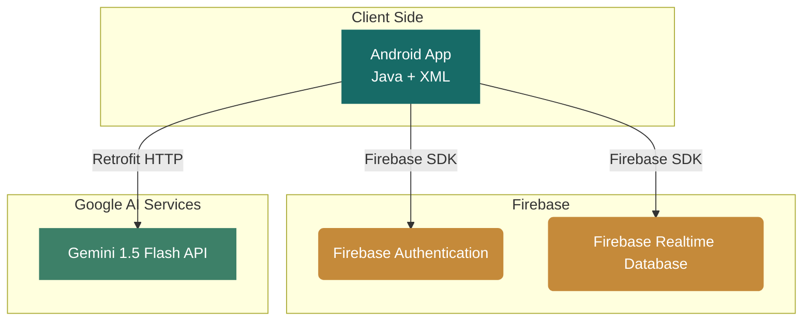

<div align="center">
  
  <h1>📚 Smart Library Management System</h1>
  <p><strong>A Premium, AI-Powered Digital Library Experience for Modern Institutions</strong></p>
  
  [](https://developer.android.com/)
  [](https://www.java.com/)
  [](https://firebase.google.com/)
  [](https://nodejs.org/)
  [](https://openai.com/)
</div>

<br/>

Welcome to the **Smart Library Management System** — a seamless, editorial-style interface designed with the "Ivory Library" theme. It provides an elegant experience for discovering, borrowing, and tracking books, integrated directly with a **Real-Time AI Assistant** for intelligent recommendations.

---

## 📸 App Screenshots

*(Note: Replace these placeholder image paths with actual screenshots of your app)*

<div align="center">
  
  &nbsp;&nbsp;
  
  &nbsp;&nbsp;
  
  &nbsp;&nbsp;
  
</div>

---

## ✨ Key Features

- 🎨 **Editorial UI/UX ("Ivory Library")**: Designed with a premium bookstore aesthetic, utilizing Warm Ivory backgrounds, Deep Indigo accents, and beautiful typography.
- 🤖 **Real-Time AI Assistant**: A Node.js backend integrated with OpenAI (or OpenRouter) provides context-aware book recommendations and library assistance directly within the mobile app.
- 🔐 **Firebase Integration**: Secure user authentication, Realtime Database for accurate book inventory, and cloud syncing.
- 📷 **QR Code Scanner**: Scan QR codes for rapid book checkouts and physical library navigation.
- 📚 **Smart Book Tracking**: Manage borrowed books, view availability in real-time, and track pending requests.

---

## 🏗 Architecture Diagram

Our architecture leverages a direct connection to the Gemini AI API for intelligent chat, while using Firebase for secure database syncing.



---

## 🛠 Technology Stack

### Mobile Frontend
- **Language**: Java
- **UI Toolkit**: XML, Material Components for Android
- **Networking**: Retrofit 2, Glide (Image Loading)

### Cloud & Database
- **Backend-as-a-Service**: Firebase Realtime Database
- **Authentication**: Firebase Auth (Email/Password & Google Sign-In)

### AI Integration
- **Intelligence**: Google Gemini 1.5 Flash API (Direct REST Integration)

---

## 🚀 Getting Started

### 1. Android Application Setup
1. Clone the repository and open the project in **Android Studio**.
2. Go to [Firebase Console](https://console.firebase.google.com/), create a project, and register this Android app (`com.example.smartlibrary`).
3. Download the `google-services.json` file and place it in the `app/` directory.
4. Enable **Authentication** (Email & Google) and **Realtime Database** in Firebase.

### 2. AI & Environment Variables Setup (.env)
The AI assistant runs directly in the app, but you must supply your own Google Gemini API key.

1. Open `app/src/main/java/com/example/smartlibrary/ai/AiRepository.java`.
2. Find the line: `private static final String API_KEY = "YOUR_GEMINI_API_KEY_HERE";`
3. Replace `"YOUR_GEMINI_API_KEY_HERE"` with your actual API key from [Google AI Studio](https://aistudio.google.com/).

> **⚠️ Security Warning:** Do NOT commit your API key to GitHub. It has been purposefully omitted from the repository.

*(Optional Backend Setup)*
If you are planning to expand the backend folder (e.g. for Supabase):
1. Navigate to the `backend/` directory.
2. Copy `.env.example` to a new file named `.env`.
3. Fill in your credentials:
```bash
cp .env.example .env
```

Click **Run** in Android Studio to build the app onto your device or emulator!

---

## 🎨 Theme Guidelines ("Ivory Library")

The application strictly follows a custom design system to maintain a professional, academic, and calm environment.

- **Primary Background**: Warm Ivory `#F7F5F0`
- **Card Background**: Crisp White `#FFFFFF`
- **Primary Text**: Deep Forest `#202625`
- **Secondary Text**: Muted Teal `#66706E`
- **Primary Accent**: Deep Teal `#176B67` (Buttons, Active Nav)
- **Secondary Accent**: Warm Gold `#C58A3A` (Highlights, Warnings)
- **Success State**: Sage Green `#3D8068`

---

## 🤝 Contributing
Contributions, issues, and feature requests are welcome! Feel free to check the [issues page](https://github.com/krupasawarkar630/SmartLibrary/issues).

## 📄 License
This project is licensed under the MIT License.
