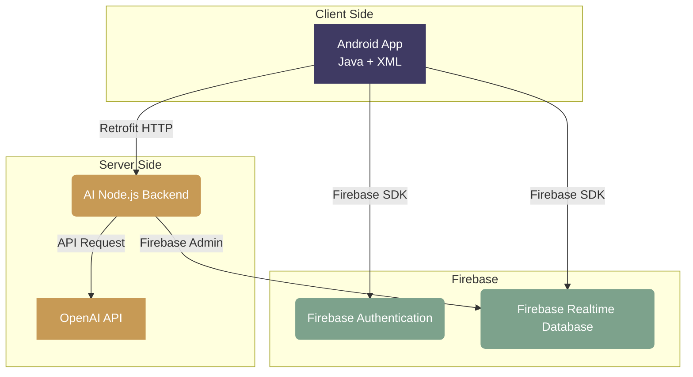

# 📚 Smart Library Management System

Welcome to the **Smart Library Management System** — a premium, AI-powered digital library experience built for modern students and institutions.

This application provides a seamless, editorial-style interface ("Ivory Library" Theme) for discovering, borrowing, and tracking books, integrated with a Real-Time AI Assistant to provide intelligent recommendations.

## ✨ Features
- **Editorial UI/UX**: Designed with a premium, bookstore aesthetic featuring Warm Ivory backgrounds, Deep Indigo accents, and beautiful typography.
- **Real-Time AI Assistant**: A Node.js backend integrated with OpenAI provides intelligent, context-aware book recommendations and library assistance directly within the app.
- **Firebase Integration**: Secure Authentication, Realtime Database for book inventory, and cloud syncing.
- **QR Code Integration**: Scan QR codes for seamless book checkouts and library navigation.
- **Book Tracking**: Keep track of borrowed books, availability, and pending requests.

## 🏗 Architecture Diagram



## 🛠 Technology Stack
- **Frontend**: Java, XML, Material Components for Android
- **Backend**: Node.js, Express.js (for AI Service)
- **Database / Auth**: Firebase Realtime Database, Firebase Authentication
- **AI Integration**: OpenAI SDK (GPT Models)
- **Networking**: Retrofit 2

## 🚀 Getting Started

### 1. Android Application
1. Open the project in Android Studio.
2. Connect your Firebase project and download `google-services.json` to the `app/` folder.
3. Build and Run the application on your device or emulator.

### 2. AI Backend Setup
The AI feature requires the local Node.js server to be running:
```bash
cd backend
npm install
```
Create a `.env` file in the `backend` folder and add your OpenAI Key:
```env
OPENAI_API_KEY=sk-your-key-here
```
Start the server:
```bash
npm start
```

*Note: If testing on a physical device, update the `BASE_URL` in `AiRepository.java` from `http://10.0.2.2:3000/` to your computer's local IP address.*

## 🎨 Theme Guidelines ("Ivory Library")
- **Primary Background**: Warm Ivory `#F7F3EA`
- **Card Background**: Soft White / Ivory `#FFFDF8`
- **Text**: Deep Ink `#24221F` & Warm Gray `#77716A`
- **Accents**: Deep Indigo `#3F3A63` & Muted Amber `#C79A55`
